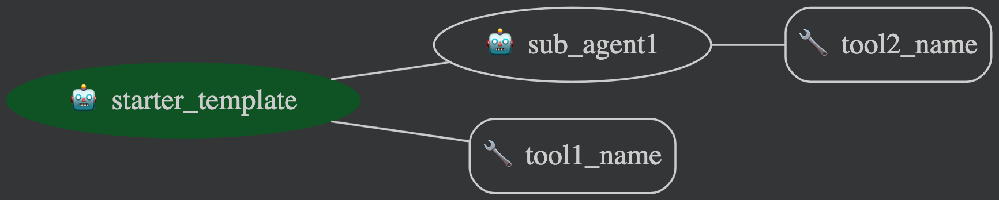

# Starter Template Agent

> [!IMPORTANT]
>
> This is a starter template to help you build your own agent using ADK!
>
> If you plan to contribute a sample to this repository, use this template as a
> building block.
>
> To do so, start by copying this `starter-template` folder over to the `agents/`
> folder and re-naming it.
>
> ```sh
> # Clone repository if not already done
> git clone https://github.com/google/adk-samples.git
> cd adk-samples
>
> # Copy starter-template to proper location
> cp -R starter-template/ agents/<YOUR_AGENT_NAME>/
> ```
>
> You are now all good to go!
>
> Reminder to stick to the following structure for your agent:
>
> ```bash
>
> ├── agent-name
> │   ├── agent_name/
> │   │   ├── shared_libraries/               # Folder contains helper functions for tools
> │   │   ├── sub_agents/                     # Folder for each sub-agent
> │   │   │   │   ├── tools/                  # Tools folder for the sub-agent
> │   │   │   │   ├── agent.py                # Core logic for the sub-agent
> │   │   │   │   └── prompt.py               # Prompt of the sub-agent
> │   │   │   └── ...                         # More sub-agents    
> │   │   ├── __init__.py                     # Initializes the agent
> │   │   ├── tools/                          # Contains the code for tools used by the router (root) agent
> │   │   ├── agent.py                        # Contains the core logic of the agent
> │   │   ├── prompt.py                       # Contains the prompt for the agent
> │   ├── deployment/                         # Deployment to Agent Engine
> │   ├── eval/                               # Folder containing the evaluation method
> │   ├── tests/                              # Folder containing unit tests for tools
> │   ├── agent_pattern.png                   # Diagram of the agent pattern
> │   ├── .env.example                        # Store agent specific env variables
> │   ├── pyproject.toml                      # Project configuration
> │   └── README.md                           # Provides an overview of the agent
> ```

## Overview

Give an overview of your sample agent, what it is designed to accomplish and how
it does so...

## Agent Details

The key attributes of the `<YOUR_AGENT_NAME>` Agent include:

| Feature              | Details                                  |
| :------------------: | :--------------------------------------: |
| **Interaction Type** | Conversational                           |
| **Complexity**       | Beginner                                 |
| **Agent Type**       | Multi Agent                              |
| **Components**       | Tools, Memory, RAG                       |
| **Vertical**         | i.e. Finance, Data Analysis, E-commerce  |

### Agent Architecture



### Component Details

* **Agents:**
  * `root_agent` - Description of router (root) agent.
  * `sub_agent1` - Description of sub-agent 1.
  * `sub_agent2` - Description of sub-agent 2.
* **Tools:**
  * `tool1_name` - Description of first tool.
  * `tool2_name` - Description of second tool.
* **Memory:**
  * ...

## Setup and Installation Instructions

### Prerequisites

* **Google Cloud Project:** You need a Google Cloud Project (for Vertex AI Gemini models)
* **Python 3.9+:** Ensure you have Python 3.9 or a later version installed.
* **Git:** Ensure you have git installed.

### Project Setup with Poetry

1. **Clone the Repository:**

    ```bash
    git clone https://github.com/google/adk-samples.git
    cd adk-samples/agents/<YOUR_AGENT_NAME>
    ```

2. **Install Dependencies with Poetry:**

    > [!NOTE]
    > If you do not already have Poetry installed you can follow the instructions on
    > the offical [Poetry website](https://python-poetry.org/docs/) or by running the
    > following:
    >
    > ```bash
    > pip install poetry
    > ```

    Install dependencies using Poetry (recommended) or pip.

    ```bash
    poetry install
    ```

    This command reads the `pyproject.toml` file and installs all the necessary
    dependencies into a virtual environment managed by Poetry.

3. **Activate the Poetry Shell:**

    ```bash
    poetry env activate
    ```

    This activates the virtual environment, allowing you to run commands within
    the project's environment. Make sure the environment is active. If not, you
    can also activate it through the following:

    ```bash
    source .venv/bin/activate 
    ```

4. **Set up Environment Variables:**

    Rename the file `.env.example` to `.env` and follow the steps in the file to
    set up the environment variables.

    > [!IMPORTANT]
    >
    > You will notice the following environment variable:
    >
    > ```bash
    > # Choose Model Backend: 0 -> AI Studio, 1 -> Vertex AI
    > GOOGLE_GENAI_USE_VERTEXAI=1
    > ```
    >
    > Gemini models can be called through two different APIs; one accessed
    > through Google AI Studio (using an API key) and the other through Vertex
    > AI (using a Google Cloud project and location).
    >
    > ADK supports both and determines usage via  `GOOGLE_GENAI_USE_VERTEXAI`
    >

    If you plan to deploy your ADK agent to Vertex AI Agent Engine we recommend
    using `GOOGLE_GENAI_USE_VERTEXAI=1`.

5. **Authenticate your Environment (Required for Vertex AI only)**

    Authenticate your local environment by running the following command:

    ```bash
    gcloud auth application-default login
    ```

6. **Add additional steps for your agent here**

    Any other prerequisite steps for your agent should go here. This could include
    database or data configuration, external API key setup, etc.

## Running the Agent Locally

You can run the agent locally using the ADK CLI or the ADK Dev UI:

1. Run agent in CLI:

    ```bash
    # replace `starter_template` with your agent's folder name
    adk run starter_template
    ```

2. Run agent with ADK Web UI:

    ```bash
    adk web .
    ```

    Select your agent's folder name from the dropdown.

### Example Interaction

Provide a quick example of how a user might interact with your agent:

> **User:** Hi there
>
> **Agent:**  Hello User!

## Evaluating the Agent (`eval/` folder)

Evaluations are an important part of assessing an agent's performance and
effectiveness at performing tasks.

The evaluation can be run using the `pytest` module:

```bash
poetry run pytest eval
```

### Evaluation Process

The evaluation framework consists of three key components:

1. **test_eval.py**: The main test script that orchestrates the evaluation
   process. It uses the `AgentEvaluator` from Google ADK to run the agent
   against a test dataset and assess its performance based on predefined criteria.

2. **data/test.json**: Contains a sequence of test cases structured as a
   conversation. Each test case includes:
   * A user query
   * Expected tool usage (which tools the agent should call and with what
    parameters)
   * Reference answers (ideal responses the agent should provide)

3. **data/test_config.json**: Defines evaluation criteria and thresholds:
   * `tool_trajectory_avg_score`: Measures how well the agent uses the
    appropriate tools
   * `response_match_score`: Measures how closely the agent's responses match
    the reference answers

When you run the evaluation, the system:

1. Loads the test cases from `test.json`
2. Sends each query to the agent
3. Compares the agent's tool usage against expected tool usage
4. Compares the agent's responses against reference answers
5. Calculates scores based on the criteria in `test_config.json`

## Deploying the Agent

The Agent can be deployed to Vertex AI Agent Engine using the following
commands:

```
python deployment/deploy.py
```

After deploying the agent, you'll be able to read the following INFO log message:

```
Deployed agent to Vertex AI Agent Engine successfully, resource name: projects/<PROJECT_NUMBER>/locations/us-central1/reasoningEngines/<AGENT_ENGINE_ID>
```

Please note your Agent Engine resource name and update `.env` file accordingly as this is crutial for testing the remote agent.

You may also modify the deployment script for your use cases.

## Testing the deployed agent

After deploying the agent, follow these steps to test it:

1. **Update Environment Variables:**
   - Open your `.env` file.
   - The `AGENT_ENGINE_ID` should have been automatically updated by the `deployment/deploy.py` script when you deployed the agent. Verify that it is set correctly:
     ```
     AGENT_ENGINE_ID=projects/<PROJECT_NUMBER>/locations/us-central1/reasoningEngines/<AGENT_ENGINE_ID>
     ```

2. **Grant RAG Corpus Access Permissions:**
   - Ensure your `.env` file has the following variables set correctly:
     ```
     GOOGLE_CLOUD_PROJECT=your-project-id
     RAG_CORPUS=projects/<project-number>/locations/us-central1/ragCorpora/<corpus-id>
     ```
   - Run the permissions script:
     ```bash
     chmod +x deployment/grant_permissions.sh
     ./deployment/grant_permissions.sh
     ```
   This script will:
   - Read the environment variables from your `.env` file
   - Create a custom role with RAG Corpus query permissions
   - Grant the necessary permissions to the AI Platform Reasoning Engine Service Agent

3. **Test the Remote Agent:**
   - Run the test script:
     ```bash
     python deployment/run.py
     ```
   This script will:
   - Connect to your deployed agent
   - Send a series of test queries
   - Display the agent's responses with proper formatting

The test script includes example queries about Alphabet's 10-K report. You can modify the queries in `deployment/run.py` to test different aspects of your deployed agent.

## Customization

### Customize Agent
You can customize system instruction for the agent and add more tools to suit your need, for example, google search.

### Customize Vertex RAG Engine
You can read more about [official Vertex RAG Engine documentation](https://cloud.google.com/vertex-ai/generative-ai/docs/rag-quickstart) for more details on customizing corpora and data.


### Plug-in other retrieval sources
You can also integrate your preferred retrieval sources to enhance the agent's
capabilities. For instance, you can seamlessly replace or augment the existing
`VertexAiRagRetrieval` tool with a tool that utilizes Vertex AI Search or any
other retrieval mechanism. This flexibility allows you to tailor the agent to
your specific data sources and retrieval requirements.
